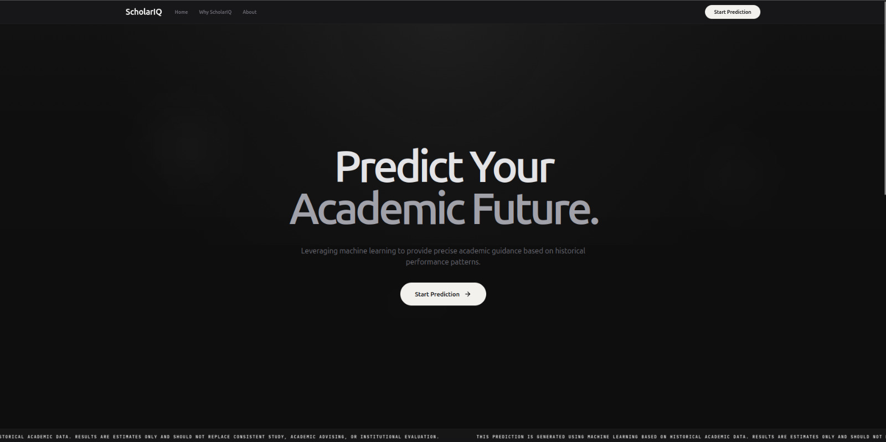

# DOKUMENTASI SISTEM SCHOLARIQ

## Document Control
| Item | Description |
|---|---|
| **Document Title** | Dokumentasi Teknis dan Analisis Sistem ScholarIQ |
| **System Name** | ScholarIQ |
| **Version** | 1.0 |
| **Date** | 2026-07-06 |
| **Documentation Standard** | Structured technical documentation for Machine Learning Application |
| **Scope** | Architecture, Machine Learning Model, API, Operational Commands, and System Scope |

---

## 1. Executive Summary

ScholarIQ adalah platform aplikasi web cerdas (AI-powered) yang bertujuan untuk memprediksi estimasi Indeks Prestasi Kumulatif (IPK) mahasiswa berdasarkan riwayat akademik, kebiasaan belajar, dan faktor gaya hidup. Sistem ini menyediakan antarmuka pengguna yang modern dan interaktif untuk mengumpulkan data serta menyajikan hasil prediksi secara visual (gauge meter 0-4).

Sistem dibangun dengan arsitektur pemisahan *frontend* dan *backend* yang jelas:

| Layer | Implementation |
|---|---|
| **Frontend** | React, Vite, Tailwind CSS, Framer Motion |
| **Backend** | Python, FastAPI, Uvicorn |
| **Machine Learning** | Scikit-Learn (Pipeline: StandardScaler + LinearRegression), Pandas, Joblib |
| **Validation** | Pydantic (Backend request validation) |

---

## 2. System Scope

### 2.1 In Scope
Sistem ini memfasilitasi fungsionalitas berikut:
- **Landing Page**: Perkenalan platform ScholarIQ, cara kerja 3 langkah, dan *disclaimer* batasan model.
- **Multi-step Form**: Pengumpulan data melalui 3 tahap (Riwayat Akademik → Kebiasaan Belajar → Gaya Hidup & Kesejahteraan).
- **Hasil Estimasi**: Menyajikan estimasi IPK dalam bentuk rentang nilai, visualisasi *gauge*, serta daftar faktor yang paling berpengaruh.
- **API Endpoint**: Endpoint `POST /predict` untuk memproses payload dan mengeksekusi model *machine learning* secara *real-time*.

### 2.2 Keterbatasan (Limitations)
- Model regresi linear memiliki **R² 0.596** (RMSE 0.409). Ini berarti sekitar ~60% variasi IPK dapat dijelaskan oleh model, sedangkan sisanya dipengaruhi faktor-faktor eksternal lain di luar jangkauan aplikasi.
- Sistem saat ini difokuskan pada prediksi statis menggunakan file `.pkl` dan tidak melakukan *training* ulang model secara mandiri di sisi server (Out of Scope untuk *Continuous Training* otomatis).

---

## 3. Architecture

Arsitektur menggunakan pemisahan modular *monorepo-style*:

```text
ScholarIQ/
  ├── backend/      # FastAPI Server, Model Inference (.pkl), Pydantic Schemas
  └── frontend/     # Vite React SPA, Tailwind UI Components, Framer Motion Animations
```

### 3.1 Backend Layer Responsibilities
| Layer | Responsibility | Example |
|---|---|---|
| **Entry Point** | Konfigurasi FastAPI, CORS Middleware, dan Lifespan (Load Model) | `main.py` |
| **Predictor** | Eksekusi model Scikit-Learn `.pkl` dari *disk* | `predictor.py` |
| **Schemas** | Validasi input dari frontend (Tipe data, range nilai) | `schemas.py` |
| **Config** | Manajemen environment variables (Allowed Origins) | `config.py` |

### 3.2 Frontend Architecture
Frontend merupakan Single Page Application (SPA) yang digerakkan oleh React:
- **Routing**: Dikelola secara internal untuk transisi antar halaman (Landing Page -> Form -> Result).
- **Styling**: Memanfaatkan *utility-class* Tailwind CSS untuk desain yang modern, *clean*, dan responsif.
- **API Client**: Mengirim HTTP request langsung ke backend FastAPI melalui URL yang didefinisikan pada `.env`.

---

## 4. Data & Machine Learning Architecture

### 4.1 Machine Learning Pipeline
- **Dependencies**: Terkunci pada `scikit-learn==1.6.1` dan `pandas==2.2.3` untuk menjamin kompatibilitas pemuatan (deserialization) file model `.pkl` menggunakan `joblib`.
- **Pipeline Structure**: `Pipeline(steps=[('scaler', StandardScaler()), ('model', LinearRegression())])`.
- **Preprocessing Khusus**: Fitur `attendance_rate` dikirim sebagai persentase (0-100) dari Frontend, namun Backend secara otomatis mengonversinya menjadi proporsi (0-1) sebelum diproses oleh model.

### 4.2 Data Features
Model memproses 8 fitur input:
1. `previous_gpa` (Float: 0.0 - 4.0)
2. `digital_literacy` (Integer: skala 1-10)
3. `attendance_rate` (Integer/Float: 0-100 persen)
4. `revision_hours` (Float)
5. `study_hours_daily` (Float)
6. `screen_time` (Float)
7. `online_course_hours` (Float)
8. `mental_stress` (Integer: skala 1-10)

---

## 5. API Specification Summary

### 5.1 Endpoints

| Method | Path | Description |
|---|---|---|
| **GET** | `/health` | Memeriksa status kesehatan server dan memastikan model berhasil di-*load*. |
| **GET** | `/` | Alias untuk endpoint `/health`. |
| **POST** | `/predict` | Memproses payload data JSON dan mengembalikan JSON berisi hasil estimasi IPK. |

### 5.2 Contoh Payload Request
```bash
curl -X POST http://localhost:8000/predict \
  -H "Content-Type: application/json" \
  -d '{
    "previous_gpa": 3.2,
    "digital_literacy": 7,
    "attendance_rate": 85,
    "revision_hours": 1.5,
    "study_hours_daily": 3.0,
    "screen_time": 4.0,
    "online_course_hours": 2.0,
    "mental_stress": 5
  }'
```

---

## 6. Operational Commands

### 6.1 Menjalankan Backend (FastAPI)
Buka terminal, masuk ke direktori utama proyek, lalu jalankan:
```bash
source venv/bin/activate
cd backend
uvicorn main:app --reload
```
- API akan berjalan di: `http://localhost:8000`
- Dokumentasi interaktif (Swagger UI) otomatis tersedia di: `http://localhost:8000/docs`

### 6.2 Menjalankan Frontend (React/Vite)
Buka terminal baru, masuk ke direktori utama proyek, lalu jalankan:
```bash
cd frontend
npm run dev
```
Frontend akan berjalan secara default di: `http://localhost:5173`

### 6.3 Build & Deploy Production
Untuk mempersiapkan Frontend menuju tahap produksi:
```bash
cd frontend
npm run build
```
*(Menghasilkan folder `dist/` yang siap di-deploy ke Vercel, Netlify, atau layanan hosting statis lainnya).*

Untuk mendeploy Backend di *cloud* (Render, Railway, VPS, dll), pastikan *environment variable* `SCHOLARIQ_ALLOWED_ORIGINS` diisi dengan domain frontend (produksi) Anda yang sebenarnya.
